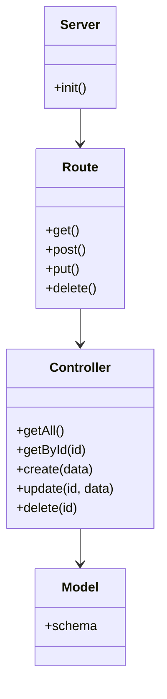

# API Rest Javascript
API direcionada para uma biblioteca com cadastro/consulta/delete de livros e autores.

## Principais Tecnologias
Javascrip

Express

MongoDb

## Estrutura Básica
1 - Server - Inicializa a aplicação Express e conecta ao MongoDB.
2 - Routes - Define as rotas da aplicação.
3 - Controllers - Manipula a lógica de negócios.
4 - Models - Define os esquemas do MongoDB.

## Diagrama de Classes

